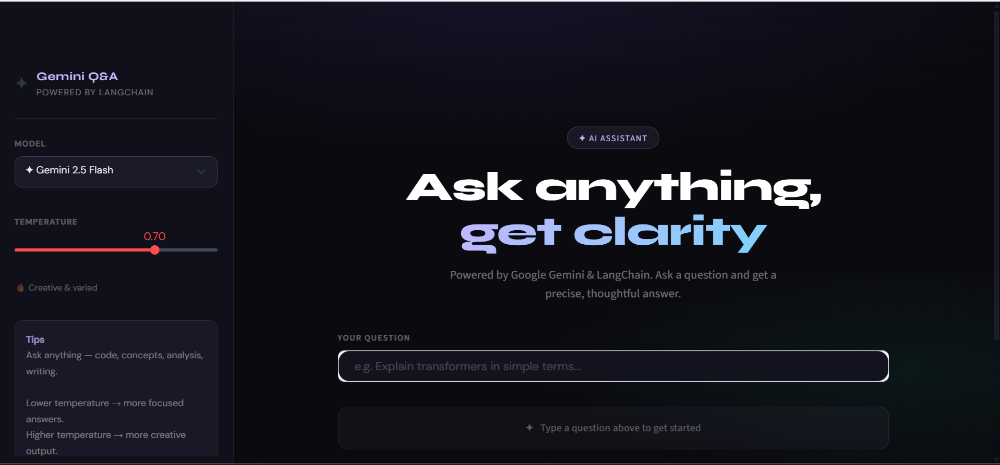

# 🚀 Gemini Q&A Chatbot

An AI-powered Q&A chatbot built using **Google Gemini**, **LangChain**, and **Streamlit** with a modern interactive UI.

This project allows users to ask questions and receive intelligent AI-generated responses in real time using Gemini models.

---

## ✨ Features

- 🤖 Google Gemini Integration
- 🔗 LangChain Prompt Chaining
- 🎨 Modern Streamlit UI
- 🌡️ Adjustable Temperature
- ⚡ Fast AI Responses
- 🧠 Multiple Gemini Model Support
- 📦 Clean and Beginner-Friendly Code

---

## 🛠️ Tech Stack

- Python
- Streamlit
- LangChain
- Google Gemini API
- dotenv

---

## 📸 Preview



---

## 📂 Project Structure

```bash
Gemini-QA-Chatbot/
│
├── assets/
│   └── Gemini.png
│
├── app.py
├── requirements.txt
├── .env
└── README.md